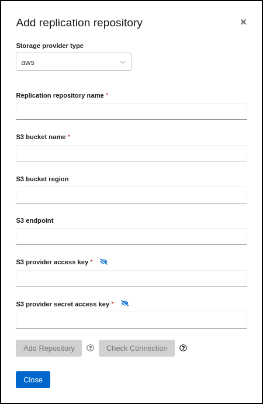
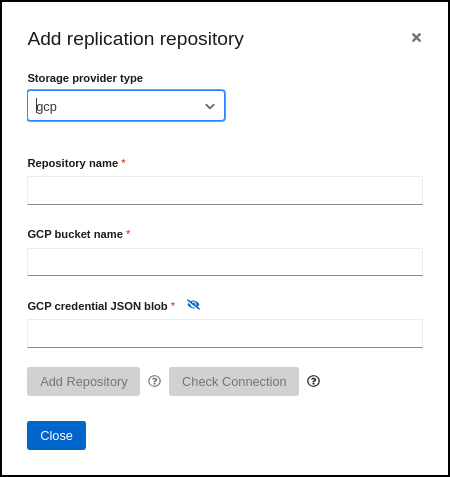

## Replication Repository Setup

Part of the Migration workflow in the CAM UI is creation of a *Replication Repository*. Configuring a Replication Repository gives CAM the information it needs to enable:

- *Object Storage* for temporary migration artifacts 
  - S3 Bucket
  - GCP Bucket
  - Azure Blob Storage

- *Disk Snapshot* to take advantage of the *snapshot* functionality offered by Cloud Provider Storage providers 
  - EBS Volume 
  - GCP Volume 
  - Azure Disk 

## Replication Repository - Configurations per Cloud Provider

After clicking the "Add" Replication Repository button in the CAM UI, you'll first choose which Cloud Provider should be used for storage and snapshots.

## AWS Configuration

For AWS, the following configuration options are exposed:

- **Replication repository name**
  - *Todo: description*
- **S3 bucket name**
  - *Todo: description*
- **S3 bucket region**
  - *Todo: description*
- **S3 endpoint**
  - *Todo: description*
- **S3 provider access key**
  - *Todo: description*
- **S3 provider secret access key**
  - *Todo: description*
  - Refer to ObjectStorage.md for details on obtaining this value.

## GCP Configuration

For GCP, the following configuration options are exposed:

- **Repository name**
  - *Todo: description*
- **GCP bucket name**
  - *Todo: description*
- **GCP credential JSON blob**
  - *Todo: description*
  - Refer to ObjectStorage.md for details on obtaining this value.

## Azure Configuration

For Azure, the following configuration options are exposed:

- **Repository name**
  - *Todo: description*
- **Azure resource group**
  - *Todo: description*
- **Azure storage account name**
  - *Todo: description*
- **Azure credentials - INI file contents**
  - *Todo: description*
  - Refer to ObjectStorage.md for details on obtaining this value.